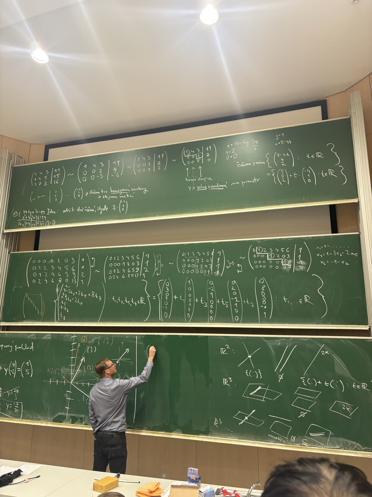

# LA1 — přednáška 02 (týden 5. 10. 2026): soustavy lineárních rovnic

**Přednáší:** David Stanovský (paralelka p2), út 6. 10. T2 a st 7. 10. T1, Troja · **Skripta:** (2.1), 2.2–2.5,
str. 39–62 ([Barto, Tůma](../zdroje/kurz/LA1_skripta_la7_barto_tuma.pdf) 🎓) · plán v [plan.md](../plan.md)

> **Zdroj zápisu:** jedna fotka tabule ze st 7. 10., 13:48 (konec přednášky), viz [obrázek](#obrázky).
> Z úterka 6. 10. fotka ani zápisky nejsou.
> Přepis je z fotky; co nebylo vidět, je označené `[nečitelné]` nebo `[mimo záběr]`. Výpočty jsem ověřil v sympy.

## Co bylo na tabuli (st 7. 10.)

### 1. Gaussova eliminace s jednou volnou proměnnou

$$
\begin{aligned}
x+4y+3z&=11\\
x+4y+5z&=15\\
2x+8y+3z&=16
\end{aligned}
$$

$$
\left(\begin{array}{ccc|c}1&4&3&11\\1&4&5&15\\2&8&3&16\end{array}\right)
\sim\left(\begin{array}{ccc|c}1&4&3&11\\0&0&2&4\\0&0&-3&-6\end{array}\right)
\sim\left(\begin{array}{ccc|c}1&4&3&11\\0&0&1&2\\0&0&1&2\end{array}\right)
\sim\left(\begin{array}{ccc|c}1&4&3&11\\0&0&1&2\\0&0&0&0\end{array}\right)
$$

- Pivoty (na tabuli zakroužkované) jsou v 1. a 3. sloupci, takže **bázové sloupce** jsou 1 a 3 (skripta Def. 2.17).
- Sloupec 2 pivot nemá: $y$ je **volná proměnná** ⇝ parametr, $y=t$.
- Zpětná substituce odspodu: $0=0$, $z=2$, $x=11-4y-\underbrace{3z}_{6}=5-4t$.

$$
\text{Řešení je množina}\quad
\left\lbrace\begin{pmatrix}5-4t\\t\\2\end{pmatrix}: t\in\mathbb R\right\rbrace
=\left\lbrace\begin{pmatrix}5\\0\\2\end{pmatrix}+t\cdot\begin{pmatrix}-4\\1\\0\end{pmatrix}: t\in\mathbb R\right\rbrace
$$

Je to přesně tvar z Věty 2.20, $\lbrace \mathbf u+\sum_{p\in P}t_p\mathbf v_p\rbrace$, tady s $P=\lbrace 2\rbrace$.

### 2. Směrový vektor řeší homogenní soustavu

$(-4,1,0)^T$ je řešením tzv. **homogenní soustavy se stejnou maticí**, tj. $(A\mid\mathbf o)$ s pravou stranou $(0,0,0)^T$.

*Idea:* odečti dvě řešení, zbyde $s\cdot(-4,1,0)^T$. Pro první rovnici:

$$
(x+4y+3z)-(x'+4y'+3z')=11-11
\quad\Longrightarrow\quad
(x-x')+4(y-y')+3(z-z')=0 .
$$

Ve skriptech je to až **Pozorování 4.45** (kap. 4.4, str. 107): když $\mathbf u,\mathbf w$ řeší $A\mathbf x=\mathbf b$, pak $\mathbf w-\mathbf u$
řeší $A\mathbf x=\mathbf o$. Přednáška to předběhla.

### 3. Větší příklad: 4 rovnice, 7 neznámých, 4 parametry

$$
\left(\begin{array}{ccccccc|c}
0&0&0&1&2&0&3&1\\
0&1&2&3&4&5&6&1\\
0&1&2&4&6&5&9&2\\
0&2&4&6&8&11&13&1
\end{array}\right)
$$

Prohodit 1. a 2. řádek, pak od 3. odečíst první a od 4. odečíst dvojnásobek prvního:

$$
\sim\left(\begin{array}{ccccccc|c}
0&1&2&3&4&5&6&1\\
0&0&0&1&2&0&3&1\\
0&0&0&1&2&0&3&1\\
0&0&0&0&0&1&1&-1
\end{array}\right)
$$

Od 3. odečíst 2., prohodit 3. a 4.:

$$
\sim\left(\begin{array}{ccccccc|c}
0&1&2&3&4&5&6&1\\
0&0&0&1&2&0&3&1\\
0&0&0&0&0&1&1&-1\\
0&0&0&0&0&0&0&0
\end{array}\right)
$$

- Pivoty jsou ve sloupcích 2, 4, 6, takže bázové proměnné jsou $x_2,x_4,x_6$, volné $x_1,x_3,x_5,x_7$ ⇝ parametry $t_1,t_3,t_5,t_7$.
- Odspodu: $x_6=-1-x_7$, $\;x_4=1-3x_7-2x_5$, $\;x_2=1-\dots=3-2t_3+2t_5+8t_7$.
- Vedle nákres odstupňovaného („schodovitého“) tvaru, Def. 2.14.

$$
\left\lbrace\begin{pmatrix}t_1\\3-2t_3+2t_5+8t_7\\t_3\\1-3t_7-2t_5\\t_5\\-1-t_7\\t_7\end{pmatrix}: t_1,t_3,t_5,t_7\in\mathbb R\right\rbrace
=\left\lbrace
\begin{pmatrix}0\\3\\0\\1\\0\\-1\\0\end{pmatrix}
+t_1\begin{pmatrix}1\\0\\0\\0\\0\\0\\0\end{pmatrix}
+t_3\begin{pmatrix}0\\-2\\1\\0\\0\\0\\0\end{pmatrix}
+t_5\begin{pmatrix}0\\2\\0\\-2\\1\\0\\0\end{pmatrix}
+t_7\begin{pmatrix}0\\8\\0\\-3\\0\\-1\\1\end{pmatrix}
: t_1,\dots\in\mathbb R\right\rbrace
$$

> ⚠️ **Na tabuli je u $t_7$ ve 4. složce 0, správně je $-3$** (z $x_4=1-3t_7-2t_5$). Ověřeno v sympy: s nulou ten vektor
> homogenní soustavu nesplňuje ($A\mathbf v=(3,9,12,18)^T$), s $-3$ ano.

### 4. Sloupcový pohled (skripta 2.5.2)

$$
x\cdot[\text{mimo záběr}]+y\cdot\begin{pmatrix}4\\-2\end{pmatrix}=\begin{pmatrix}1\\5\end{pmatrix}
$$

- Na obrázku se $\mathbf b=(1,5)^T$ skládá z násobků sloupců; nakreslený první sloupec je $(2,3)^T$ (začátek rovnice je mimo fotku).
- Odhady z obrázku: $(1,5)^T\doteq\tfrac43\cdot(2,3)^T$, $\doteq-\tfrac13\cdot(4,-2)^T$. Další popisky ($\tfrac12\cdot(2,3)^T$, $\tfrac23\cdot(4,\dots)^T$,
  $\tfrac25\cdot(\dots)$) zakrývá přednášející.
- Vlevo dole $y=-\tfrac13$ přeškrtnuté, zarámované $y=-\tfrac{7}{[\text{nečitelné}]}$.
- *Moje kontrola, ne z tabule:* je-li první sloupec $(2,3)^T$, vychází $x=\tfrac{11}{8}$, $y=-\tfrac{7}{16}$.

### 5. Řádkový pohled (skripta 2.5.1): jak může vypadat množina řešení

- $\mathbb R^2$ (rovnice = přímka): různoběžky → jeden bod; rovnoběžky → $\emptyset$; tatáž přímka 2× → celá přímka
  $\lbrace \mathbf u+t\mathbf v: t\in\mathbb R\rbrace$.
- $\mathbb R^3$ (rovnice = rovina): dvě různoběžné roviny → přímka; rovnoběžné roviny → $\emptyset$; tatáž rovina 2× → rovina;
  tři roviny se společným bodem → bod; tři roviny bez společného bodu → $\emptyset$ (popisek u obrázku `[nečitelné]`, asi „různoběžné“).
- $\mathbb R^4$: „…“ (na tabuli jen naznačeno; obecně průnik nadrovin, viz skripta 2.5.1).

## Poznámky / chyby

- Překlep na tabuli u vektoru $t_7$ (0 místo $-3$), viz výše. Při opisování z tabule si výsledek vždycky dosaď zpátky.
- Bázové sloupce skripta definují přes odstupňovaný tvar z Gaussovy eliminace (Def. 2.17). Že nezáleží na průběhu
  eliminace, se dokazuje až později.
- **Souvislost:** „obecné řešení = jedno (partikulární) řešení + všechna řešení homogenní soustavy“ (skripta 4.4: $\lbrace \mathbf u+\operatorname{Ker}A\rbrace$)
  má stejnou strukturu jako lineární diferenciální rovnice a lineární rekurence. Směrem k financím: sloupcový pohled =
  replikace výplaty portfoliem (už v [`80_mapa_matematiky/souvislosti.md`](../../../80_mapa_matematiky/souvislosti.md)).

## Otázky / nejasné

- Úterní přednáška 6. 10. chybí: doplnit ze záznamu (SharePoint, odkaz na webu kurzu) nebo z vlastních zápisků.

## Obrázky

